# Ammeter Testing Exercise - Embedded Systems Quality Assurance

# Read ALL the document before starting the exercise

## Objective
Design a comprehensive testing framework for current measurement systems using multiple ammeter types, demonstrating software testing skills in an embedded systems context.

## Before You Start
- read the README.md file in the repository
- make the main.py script work and return data from the ammeters.
- you may need to install some libraries to run the code. if so write which libraries you installed in the final documentation.

## Ammeter Testing in Embedded Systems:
 A Comprehensive Quality Assurance Approach
Introduction to Current Measurement in Embedded Systems
Current measurement is a critical aspect of embedded systems engineering, serving as a fundamental diagnostic and performance evaluation tool across various domains. From industrial automation to renewable energy systems, precise current measurement provides insights into system behavior, energy consumption, and potential operational anomalies.
In embedded systems, current measurement accuracy can be the difference between optimal performance and catastrophic system failure.

# The setup diagram

```mermaid
---
config:
layout: elk
---
flowchart TB
%% Power Source
PS[Power Supply<br>0-12V DC] --> |Power| EB[Embedded Board]
    PS --> |Power| AM


    %% Ammeter
    AM["Selected Ammeter<br>Measurement Device<br><br> (The emulators) "]

    %% Connections
    EB --> |Measurement| AM

    %% Ammeter to Computer
    AM <--> |Data Transfer| PC["Computer <br> Analysis Station. <br><br> (Your Code runs here)"]

    subgraph   
        AM 
        PC
    end
    
    %% Annotations
    classDef highlight fill:#000,stroke:#0A0,stroke-width:2px;
    class AM highlight;
    
    %% Embedded Board Components
    subgraph "Embedded Board"
        µC[Microcontroller] 
        ADC[Memory<br>Space]
        COM[Communication<br>Interface]
     
    end
```

## Problem Statement
 Our testing framework addresses several key challenges:

### 1. Unified Measurement API
- Develop a unified testing interface that can:
  * Work with multiple ammeter types (Greenlee, ENTES, CIRCUTOR)
  * Provide consistent result reporting

### 2. Measurement Sampling
- Implement sampling mechanism with configurable:
  * Number of measurements
  * Total test duration
  * Sampling frequency
- Ensure precise timing and data collection

### 3. Result Analysis
Implement comprehensive result analysis including:
- Statistical metrics:
  * Mean current
  * Median current
  * Standard deviation
  * Minimum and maximum values
#### Bonus Challenges:
- Visualization of measurement data
- Performance consistency evaluation

### 4. Result Management
- Create a robust result archiving system:
  * Unique identification for each test run
  * Metadata storage
  * Easy retrieval and comparison of historical results

### 5. Accuracy Assessment - Bonus Challenges
- Develop a method to:
  * Compare measurements across different ammeter types
  * Determine relative accuracy
  * Identify most reliable measurement method
- Use statistical techniques to quantify measurement precision

## Evaluation Criteria
The test will be assessed on:
1. Code quality and structure
2. Flexibility of the testing framework
3. Comprehensive error handling
4. Clear and informative result reporting
5. Potential for extension and reuse

## Bonus Challenges
- Implement error simulation
- Add advanced visualization techniques
- Create a configuration-driven testing approach

## Deliverables
1. Complete Python implementation
2. README with usage instructions
3. Sample test results
4. Brief documentation explaining design decisions

## Technical Constraints
- Use existing ammeter emulation infrastructure - if you get an error in the code, please fix it. and explain the fix in the documentation.
- Minimize external library dependencies
- Ensure cross-platform compatibility
- Provide clear, readable code

